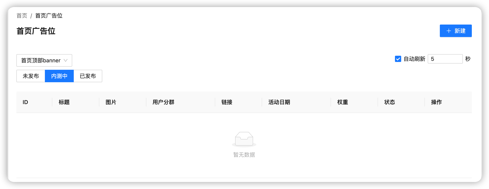

## 自动刷新

主要用于后台的数据自动刷新

## 适用范围

自动刷新组件适用于目前后台系统中所有需要自动定时刷新的数据模块

## 代码演示

<code src="./demos/default.tsx"  />

<code src="./demos/table.tsx" />

## 目前已使用模块

**听力后台：听力资源管理** [https://admin.shanbay.com/listen-resource/#/](https://admin.shanbay.com/listen-resource/#/)

`首页广告位` [https://admin.shanbay.com/listen-resource/#/carousels](https://admin.shanbay.com/listen-resource/#/carousels)

`Section 广告` [https://admin.shanbay.com/listen-resource/#/advertisements](https://admin.shanbay.com/listen-resource/#/advertisements)

`首页顶部tab管理` [https://admin.shanbay.com/listen-resource/#/web-tabs](https://admin.shanbay.com/listen-resource/#/web-tabs)

`搜索栏` [https://admin.shanbay.com/listen-resource/#/search](https://admin.shanbay.com/listen-resource/#/search)

## API

自动刷新的属性说明如下：

| 参数       | 说明                               | 类型                       | 默认值 | 版本  |
| ---------- | ---------------------------------- | -------------------------- | ------ | ----- |
| isChecked  | 是否选择开启自动刷新               | boolean                    | false  | 0.1.0 |
| inputValue | 设置刷新时间间隔,单位为 s          | number                     | 5      | 0.1.0 |
| onCheck    | 点击是否开启自动刷新选择框时的回调 | (checked: boolean) => void | -      | 0.1.0 |
| onInput    | 时间间隔输入框值变化时的回调       | (value: number) => void    | -      | 0.1.0 |
